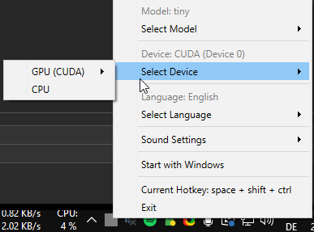

# Vibe-Hotkey-Windows

A minimal Windows application that transcribes microphone audio to text with a single hotkey press, leveraging CUDA's GPU acceleration for blazing-fast performance. Developed for my personal *vibe coding* needs.



*🎥 [Demo Video (Activate Sound!)](#) - Showing "My cat is very cute" transcription example*

## 🚀 Features
- **One-Click Transcription** - `Ctrl+Shift+Space` starts/stops recording
- **GPU Acceleration** - NVIDIA CUDA support (quick!)
- **CPU Fallback** - Fallbacks to CPU  when CUDA is not available (slow!)
- **Tray Icon Feedback** - Visual/audio cues for every state
- **Model Management** - Download/delete AI models on demand
- **Start with Windows** - Always-ready transcription service

> **Pro Tip**  
> Use the `distil-large-v3` model if you have a racemt NVIDIA GPU with more than 3.5GB VRAM.  
> *Transcribes 30s audio in ~1s on an RTX 4070 Super and it is incredibly accurate.*

## ⚙️ Installation

### Prerequisites
- Windows 10/11 64-bit
- [UV (Python package manager)](https://docs.astral.sh/uv/getting-started/installation/)
- [NVIDIA CUDA Toolkit 12.2](https://developer.download.nvidia.com/compute/cuda/12.2.0/local_installers/cuda_12.2.0_536.25_windows.exe) (Needed for GPU acceleration)

### Setup
1. **Clone Repository**
   ```powershell
   git clone https://github.com/viewviewview/vibe-hotkey-windows
   cd vibe-hotkey-windows
   ```

2. **Install Dependencies**  
   Using [UV](https://docs.astral.sh/uv/getting-started/installation/):
   ```powershell
   uv venv # create venv
   uv sync # install packages
   ```

3. **(Optional) CUDA Setup**  
   Required for GPU acceleration:
   - Download [CUDA 12.2](https://developer.download.nvidia.com/compute/cuda/12.2.0/local_installers/cuda_12.2.0_536.25_windows.exe)
   - Install **even if you have other CUDA versions** already installed. Newer CUDA installers do not include cuBlas which is required for faster-whisper.

## 🎮 Usage

1. **Launch App**
   ```powershell
   uv run src\main.py

   # or, if you are annoyed by the console.
   uv run src\consoleless.pyw
   # Please note that consoleless.pyw and main.py maintain different start menu/autostart entries
   ```

2. **System Tray Controls**  
   Right-click the tray icon for:
   - Model selection (downloads the model on demand if you never used it before.)
   - Language switching (EN/DE/FR supported)
   - Audio device configuration
   - Hotkey customization

3. **Icon indicators**  
   | Icon | State | Description |
   |------|-------|-------------|
   |  | **Loading** | Model download & loading model to (V)RAM |
   |  | **Ready** | Waiting for hotkey input |
   |  | **Recording** | Capturing microphone audio |
   |  | **Transcribing** | Converting audio to text |

4. **Hotkey**  
   Default: `Ctrl + Shift + Space`  
   *Configurable via tray menu*

5. **Model selection and deletion**  
    Simply left click the model you want to use. It will download the model, if you haven't already. You can right click a model in the same selection screen to delete it from disk.


## 📦 Model Size Information

> As a rule of thumb: the bigger the model, the better the performance. *I found `large-v3` to be sufficient for most of my tasks (which is mainly speaking to Sonnet in Cursor and DeepSeek R1 :smile:).*

| Model      | Size   | Accuracy | GPU Speed* | CPU Speed* |
|------------|--------|----------|------------|------------|
| `tiny`     | 75 MB  | Basic    | 0.3s       | 5s         |
| `medium`   | 1.5 GB | Good     | 0.8s       | 30s        |
| `large-v3` | 3 GB   | Excellent| 1.2s       | 90s        |

*\*Approximate times for 30s audio on RTX 4070 Super/i7-8700K @ 4.7GHz*

**Storage Location**:  
`%LOCALAPPDATA%\VibeHotkeyWindows\models\`

## ⚡ Config.json

Everything can configured via the GUI, however, you might want to add additional languages which you speak to the ``config.json``:

```json5
{
  "hotkey": ["ctrl", "shift", "space"],
  "model": "tiny",
  "system_prompt": "Transcribing audio in {language}:",
  "language": "English",
    "available_languages": [
    // You might want to add additional languages supported by faster-whisper v3 here!
    // The default config is only having German, French and English as presets, as I only speak these languages. :)
    {
      "code": "de",
      "name": "German"
    }
  ],
  "device_mode": "cuda", // "cpu" or "cuda"
  "cuda_device": 0, // ID of the cuda device to use. Useful if you have multiple GPUs
  "auto_paste": false, // Automatically paste text after transcription
  "sound_settings": {
    "start_record": true,
    "stop_record": true,
    "transcription_done": true,
    "transcription_empty": true
  }
}
```

## 🙌 Acknowledgements
- Voice Models: [Systran/faster-whisper](https://github.com/SYSTRAN/faster-whisper)
- UI Sounds: [IENB's UI Buttons](https://freesound.org/s/762132/)
- Inspired by [Karpathy's *Vibe Coding* Tweet](https://x.com/karpathy/status/1886192184808149383)

---

**Like this project?**  
⭐ Star the repo and share with your Windows-using friends!